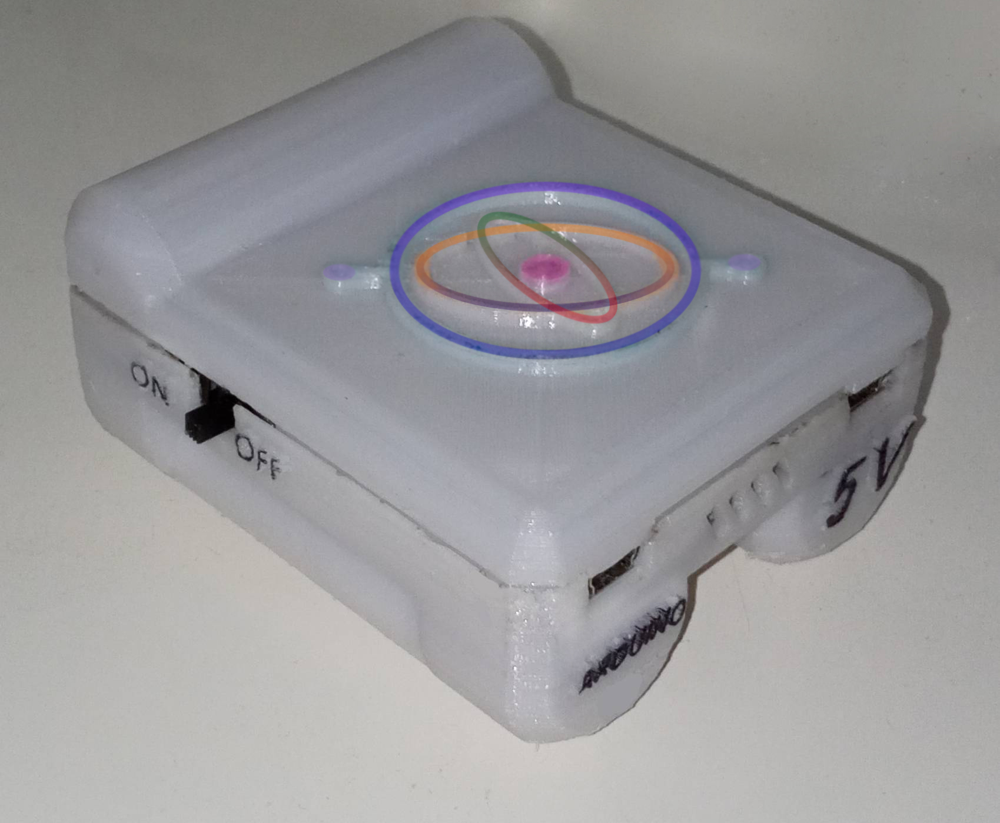

# Vibration amplitude measurement
> The device is designed to measure the amplitude of vibrations rigid busbar. 
```diff
-red For educational purposes only
```
## Table of contents
* [General info](#general)
* [Microcontroler (Arduino) and peripherals](#arduino)
  + [Components](#components)
  + [Calibration of sensors](#calibration)
  + [Libraries](#libraries)
  + [Connecting](#connecting)
  + [Arduino program](#aprogram)
  + [Kalman filter](#kalman)
* [Python program](#pyprog)
* [Device case](#case)


<a name="general"></a>
## General info

Arduino microcontroller was used to build the device. Special attention was given to use of a cheap inertial sensors (they were bought on AliExpress for a few dollars).Vibration visualization is based on the accelerations obtained due to the accelerometer.

Additionaly application has been created to display the accelerations on the graphic. It allows to connect to the device via bluetooth. After collecting measurement data, they will be saved in excel file.

At the end all components were soldered on a breadboard and a device case was designed and printed. 



<a name="arduino"></a>
## Microcontroler (Arduino) and peripherals

In this section I have described all components I have used to build the device. I have also shown how to put all things together.

<a name="components"></a>
### Components
* Arduino Nano
* MPU-6050 
* Bluetooth module HC-05
* Step up converter 2...5v to 5v
* Battery 18650
* Сharge controller TP4056

<a name="Calibration"></a>
### Calibration of sensors
Use this [sketch](https://github.com/jrowberg/i2cdevlib/tree/master/Arduino/MPU6050/examples/IMU_Zero) for calibration
<a name="libraries"></a>
### Libraries
In order to use my program you need to download and include [MPU6050 library](https://github.com/jrowberg/i2cdevlib). 

<a name="connecting"></a>
### Connecting
First of all you need to connect all pieces together just like on the picture below if you are using program from my GitHub. The Bluetooth module goes through voltage level translator, because the module works on 3.3V and Arduino on 5V. If you don't have one and don't want to buy it you can also make voltage divider so not to damage the module.


<a name="aprogram"></a>
### Arduino program
Microcontroller during startup initiates software UART communication with a transmission speed of 115200 bit/s on pins 10 and 11, up to which a bluetooth module is connected. Then a connection with MPU is established. The accelerometer scale is set to ±8G. The internal low-pass filter with a 5Hz band is activated, and then offsets and scale factors values, obtained by calibration, ​​are set. In the main loop the measurement values are cyclically read. This data are sent by the bluetooth module to PC.

<a name="kalman"></a>
### Kalman filter
First of all it is necessary to get orientation of device in order to compensate acceleration of gravity from measurements. In this case, the Kalman filter was used.

<a name="compensation"></a>
### Compensation of gravitational acceleration
With each measurement, the gravitational acceleration vector is first rotated to the device coordinate system, which is obtained after the filtration described above. The components of gravitational acceleration are then subtracted from the measurements provided by the sensor, thus obtaining information about the acceleration with which the device moved.

Pictures above show plots of acceleration with compensation.


<a name="pyprog"></a>
## Python program

Functional requirements:
* processing of data collected from the sensors so as to obtain the value of displacement and speed of the device
* saving a series of measurement data in excel
* visualization of information in the application
* establishing a Bluetooth connection between PC and device 

Screenshots:
<p float="left" style="text-align: center;">
  
</p>

<a name="case"></a>
## Device case


